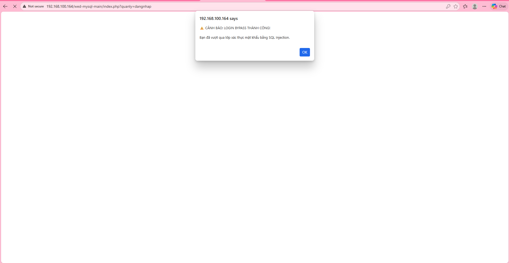
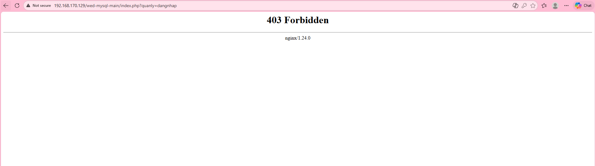
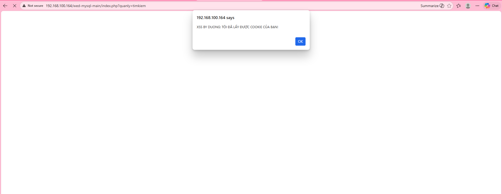

# 🛡️ TRIỂN KHAI WAF VỚI MODSECURITY TRÊN NGINX
## Đề tài: Xây dựng hệ thống Reverse Proxy bảo vệ ứng dụng Web PHP khỏi tấn công SQL Injection và XSS

### 📖 Giới thiệu
Dự án này triển khai giải pháp **Web Application Firewall (WAF)** sử dụng **ModSecurity v3** tích hợp trên **Nginx** theo mô hình **Reverse Proxy**. Hệ thống được thiết kế để bảo vệ một ứng dụng web bán hàng (PHP/MySQL) khỏi các cuộc tấn công phổ biến nằm trong OWASP Top 10, cụ thể là **SQL Injection** và **Cross-Site Scripting (XSS)**.

---

### 👥 Danh sách thành viên nhóm
| STT | Họ và tên | Mã sinh viên | Vai trò |
|:---:|:---|:---:|:---|
| 1 | **Nguyễn Xuân Dương** | 22810310396 | **Nhóm trưởng** |
| 2 | **Đồng Viết Minh** | 22810310393 | Thành viên |
| 3 | **Hồ Đức Thắng** | 22810310404 | Thành viên |

---

### 📅 Phân chia công việc
| Thành viên | Nhiệm vụ chính |
|:---|:---|
| **Nguyễn Xuân Dương** | - Nghiên cứu tổng quan về ModSecurity, Nginx.<br>- Dựng Server Ubuntu (WAF) và cấu hình Reverse Proxy.<br>- Cài đặt và tích hợp bộ luật OWASP CRS.<br>- Tổng hợp báo cáo . |
| **Đồng Viết Minh** | - Nghiên cứu lý thuyết tấn công SQL Injection và XSS.<br>- Thực hiện kiểm thử tấn công (Red Team): Tìm và khai thác lỗ hổng.<br>- Kiểm tra log hệ thống và chụp ảnh minh chứng kết quả.<br>- Soạn thảo nội dung báo cáo chương Kết quả. |
| **Hồ Đức Thắng** |- Xây dựng Website bán hàng Demo (PHP thuần + MySQL).<br>- Thiết kế cơ sở dữ liệu (`tbl_dangky`, `tbl_sanpham`).<br>- Lập trình các đoạn mã lỗi (Vulnerable Code) cho chức năng Đăng nhập và Tìm kiếm. | 

---

### 🏗️ Kiến trúc hệ thống
Hệ thống hoạt động theo mô hình **Reverse Proxy**:
1.  **Frontend (WAF):** Máy ảo Ubuntu chạy Nginx + ModSecurity.
    * IP: `192.168.170.129`
2.  **Backend (App):** Máy thật Windows chạy XAMPP (Apache + MySQL).
    * IP: `192.168.170.1` (Kết nối qua VMnet8).

---

### 🚀 Hướng dẫn cài đặt & Sử dụng

#### 1. Yêu cầu môi trường
* **VMware Workstation** (để chạy Ubuntu).
* **XAMPP** (để chạy Web PHP).
* Trình duyệt Web (Chrome/Firefox).

#### 2. Khởi chạy hệ thống
1.  **Bật Backend:** Mở XAMPP Control Panel, Start **Apache** và **MySQL**.
2.  **Bật WAF:** Khởi động máy ảo Ubuntu. Kiểm tra dịch vụ Nginx:
    ```bash
    sudo systemctl status nginx
    ```
3.  **Truy cập:** Mở trình duyệt, truy cập vào địa chỉ IP của WAF:
    > `http://192.168.170.129/`

#### 3. Các Payload dùng để Demo (Test)

**a. Kịch bản 1: SQL Injection (Login Bypass)**
* **Vị trí:** Trang Đăng nhập.
* **Payload:**
    ```sql
    admin' OR 1=1-- 
    ```
    *(Lưu ý có dấu cách ở cuối)*

**b. Kịch bản 2: SQL Injection (Data Dump)**
* **Vị trí:** Trang Tìm kiếm sản phẩm.
* **Payload:**
    ```sql
    ' UNION SELECT 1, tenkhachhang, matkhau, 4 FROM tbl_dangky#
    ```

**c. Kịch bản 3: XSS (Reflected)**
* **Vị trí:** Trang Tìm kiếm sản phẩm.
* **Payload:**
    ```html
    <script>alert('Hacked')</script>
    ```

---

### 📸 Kết quả Demo (Hình ảnh thực tế)

#### 1. Chặn SQL Injection (Login Bypass)
*Hacker cố gắng đăng nhập trái phép bằng `' OR 1=1`.*

**❌ Khi chưa bật WAF (Bị Hack):**

*(Hệ thống thông báo đăng nhập thành công hoặc lộ giao diện Admin)*

**✅ Khi bật WAF (Đã chặn):**

*(ModSecurity chặn và trả về lỗi 403 Forbidden)*

#### 2. Chặn SQL Injection (Data Leak)
*Hacker cố gắng dùng `UNION SELECT` để lấy danh sách User/Pass.*

**❌ Khi chưa bật WAF (Lộ dữ liệu):**

*(Danh sách khách hàng bị hiển thị ngay trên giao diện tìm kiếm)*

**✅ Khi bật WAF (Đã chặn):**

*(Hệ thống chặn request độc hại)*

#### 3. Chặn Cross-Site Scripting (XSS)
*Hacker chèn mã script độc hại vào ô tìm kiếm.*

**❌ Khi chưa bật WAF (Bị dính mã độc):**

*(Trình duyệt hiển thị Popup cảnh báo)*

**✅ Khi bật WAF (Đã chặn):**

*(ModSecurity phát hiện thẻ script và chặn ngay lập tức)*

---

### 📝 Ghi chú
* Log tấn công có thể xem tại: `/var/log/nginx/error.log`
* Để tắt/bật WAF, chỉnh sửa file: `/etc/nginx/modsec/modsecurity.conf` (`SecRuleEngine On/DetectionOnly`).

---
*Đồ án học phần Phát triển phần mềm Web An toàn - D17CNPM6 - Đại học Điện Lực (EPU)*
